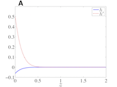

# cell-migration-similarity-soln
=======================

The MATLAB code contained in the cell-migration-similarity-soln project was developed for the work described in:
[Tracy L. Stepien](http://math.arizona.edu/~stepien/) and [Hal L. Smith](http://math.asu.edu/~halsmith/), Existence and uniqueness of similarity solutions of a generalized heat equation arising in a model of cell migration, Discrete Contin. Dyn. Syst., 35 (2015), 3203-3216, DOI: [10.3934/dcds.2015.35.3203](http://dx.doi.org/10.3934/dcds.2015.35.3203).

Numerical solutions of the boundary value problem
x''(t) = c(x'(t)+1)^n (x(t)−t x'(t)),
x'(0) = a−1,
lim_{t-> infinity} x'(t) = 0,
where c, n, and a are parameters, are obtained by using a shooting method combined with the secant method.

Authors: [Tracy Stepien](http://github.com/tstepien/)

## Programs

+ program_solve_bvp.m: run this program to solve the boundary value problem
+ program_buildstablemanifold.m: run this program to solve many boundary value problems and save the corresponding x(0) and x'(0) values in a .mat file
+ program_solve_ivp.m: run this program to solve the initial value problem (no boundary condition at t->infinity)

## Plots

+ plot_of_sims.m - reproduce Figure 1

+ plot_of_manifold.m - reproduce Figure 3

## Auxiliary Files

+ secant.m
+ selfsimJac.m
+ selfsimODE.m
+ shoot.m
+ solveBVP.m
+ solveIVP.m

## Data Files

+ data/n0_data.mat
+ data/n2_data.mat
+ data/n3_data.mat
+ data/n5_data.mat
+ data/samplesim_n2_c25_y0_np5.mat
+ data/samplesim_n2_c25_y0_p5.mat

## Licensing

Copyright 2013-2015 Tracy Stepien.  This is free software made available under the MIT License. For details see the LICENSE.txt file.
